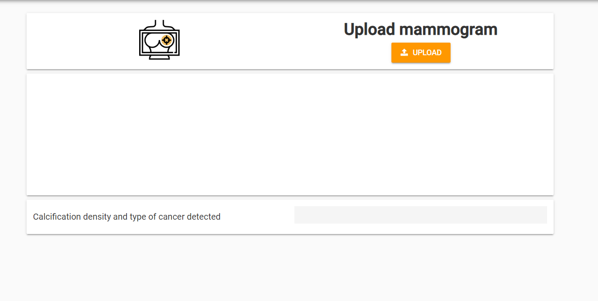
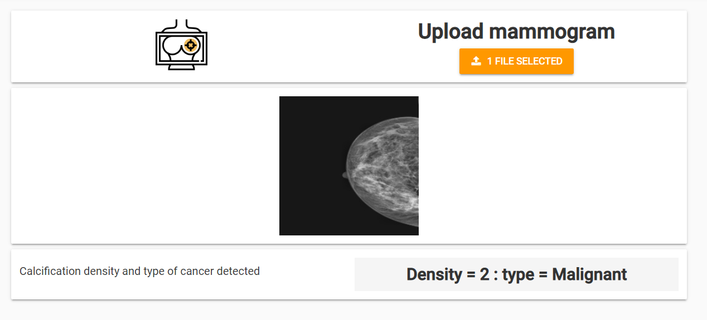
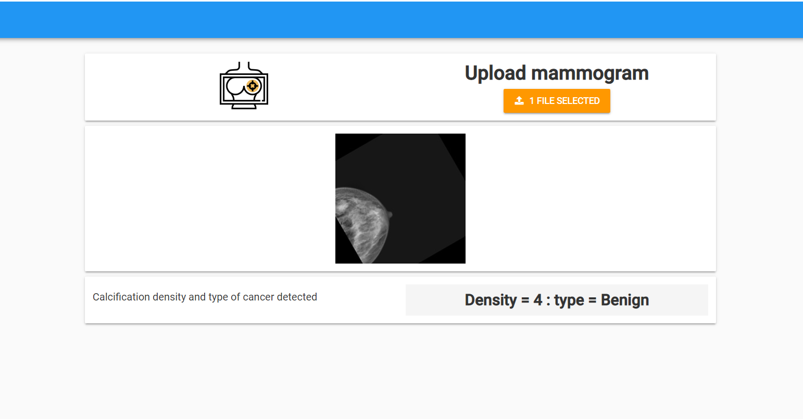
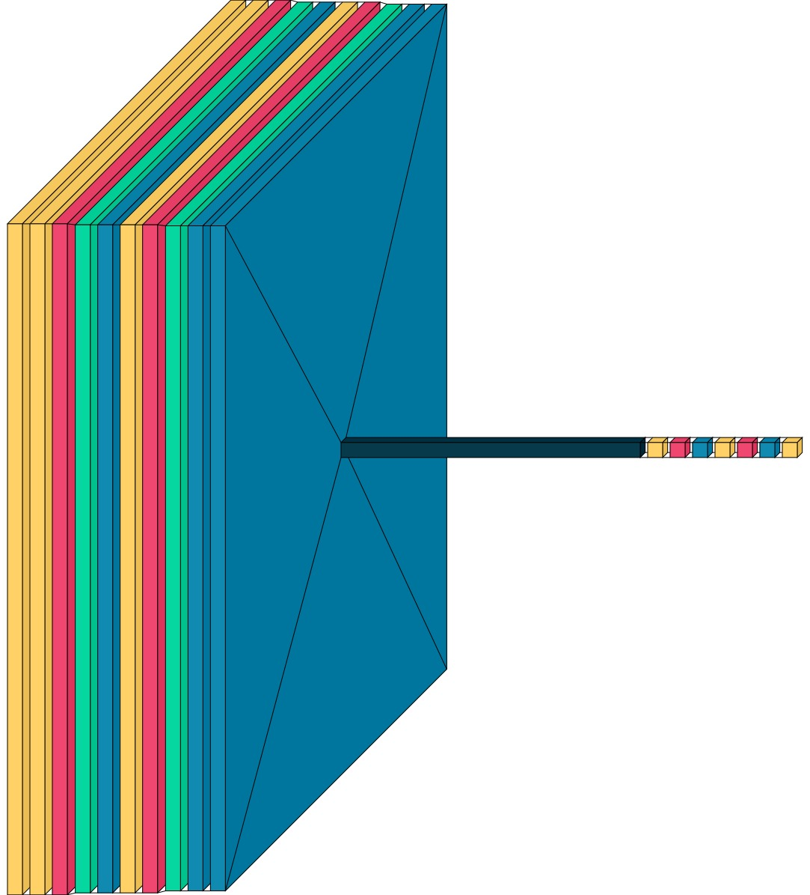
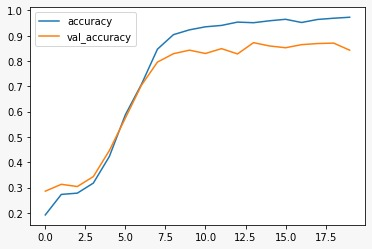
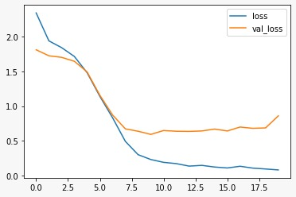

# Breast Cancer Detection

Breast Cancer is one of the highest cause for death in women, it's early identification increases the chances of survival and can help save many lives.
We Trained a model to detect the level of calcification on a scale of 1 to 4 in a breast cancer image submitted by the user and classify it as benign or malignant. The model has an accuracy score of 90\% on validation dataset.

----------------------------------------------------------
##Images from Webapp
To use the webapp visit https://GPW5JFXKJ4OYCXAQ.anvil.app/TX2LVB3MJEOYZY3JUPJ3QEA5

-------------------------------------------------------------------------------------------------

## Model Specification
 Layer (type)                Output Shape              Param #   

 conv2d (Conv2D)             (None, 224, 224, 32)      320       
                                                                 
 conv2d_1 (Conv2D)           (None, 224, 224, 64)      18496     
                                                                 
 batch_normalization (BatchN  (None, 224, 224, 64)     256       
 ormalization)                                                   
                                                                 
 max_pooling2d (MaxPooling2D)  (None, 223, 223, 64)     0         
                                                                
                                                                 
 dropout (Dropout)           (None, 223, 223, 64)      0         
                                                                 
 conv2d_2 (Conv2D)           (None, 223, 223, 64)      36928     
                                                                 
 batch_normalization_1 (Batc  (None, 223, 223, 64)     256       
 hNormalization)                                                 
                                                                 
 max_pooling2d_1 (MaxPooling  (None, 222, 222, 64)     0         
 2D)                                                             
                                                                 
 dropout_1 (Dropout)         (None, 222, 222, 64)      0         
                                                                 
 dropout_2 (Dropout)         (None, 222, 222, 64)      0         
                                                                 
 flatten (Flatten)           (None, 3154176)           0         
                                                                 
 dense (Dense)               (None, 64)                201867328 
                                                                 
 batch_normalization_2 (Batc  (None, 64)               256       
 hNormalization)                                                 
                                                                 
 dropout_3 (Dropout)         (None, 64)                0         
                                                                 
 dense_1 (Dense)             (None, 128)               8320      
                                                                 
 batch_normalization_3 (Batc  (None, 128)              512       
 hNormalization)                                                 
                                                                 
 dropout_4 (Dropout)         (None, 128)               0         
                                                                 
 dense_2 (Dense)             (None, 8)                 1032      
                                                                 
----------------------------------------------------------------
######
Total params: 201,933,704
Trainable params: 201,933,064
Non-trainable params: 
__________________________________________________________
## Model Visualisation
#

______________________________________________________________________________________
#
#
## Variation of accuracy on training and validation data across the training process
#
#

_________________________________________________________________________________________
## Variation of loss on training and validation data across the training process
#
#

____________________________________________________________________________________________
## Version
### -Version 1
The web app accepts mammograms either coloured or gray scale standardizes it, gives a density rating of 1 to 4 and type of benign or malignant.
#
### -Version 2
Prospective functionality may include a failed for the users to submit their images to our database which will then be used to update our model on new data ans possibly integrating our model with the use of transfer learning.

